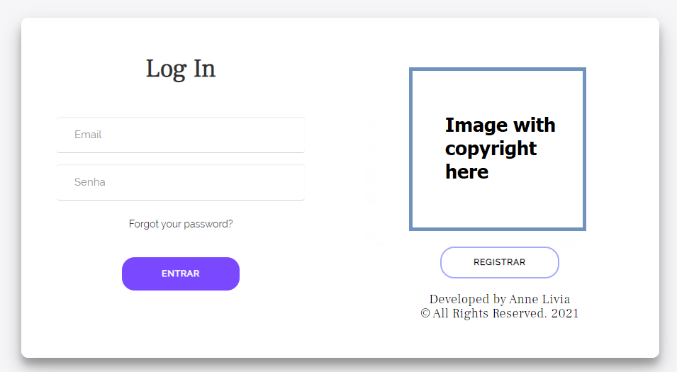
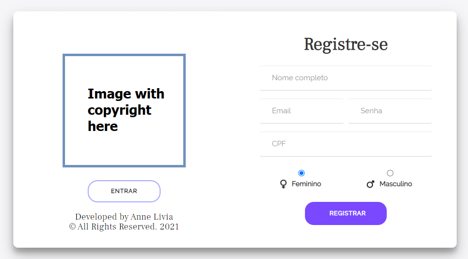
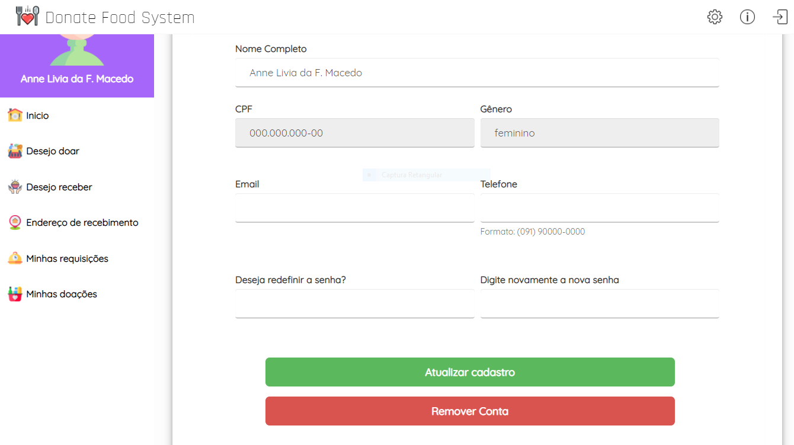

# Donate Food System

This website was developed to facilitate food donations between people in order to minimize the effects of global hunger.

When considering the use of information technology for solidarity, observing the high rate of food insecurity in Brazil and in the world, and understanding the importance of food donations to reduce hunger, it was proposed a web application that facilitates the connection between food donor and an organization, individual or legal entity that needs these donations. The user will have the freedom to request the donation of food, as well as to make donations.

# System Development 

The application was developed using PHP, JavaScript, HTML, CSS, Bootstrap, jQuery, AJAX and MySQL database.

Further improvements will still be done on the project, such as: the architecture style that fits the system, improvement of the code, usage of design patterns, database improvements and so on. The software is in its initial stage.

# Icons

 ALL icons made by <a href="https://www.freepik.com" title="Freepik">Freepik</a> from <a href="https://www.flaticon.com/" title="Flaticon">www.flaticon.com</a>

# Interface (just some images)

<h2 align="center">Login</h2>

  </img>

<h2 align="center">Sign Up</h2>

  </img>

<h2 align="center">Home</h2>

  </img>

<h2 align="center">User's Settings</h2>

  </img>

<h2 align="center">Some Alerts</h2>

  </img>

<h2 align="center">Request Donation</h2>

  </img>

<h2 align="center"> Developed by Anne Livia
 © All Rights Reserved. 2021</h2>
